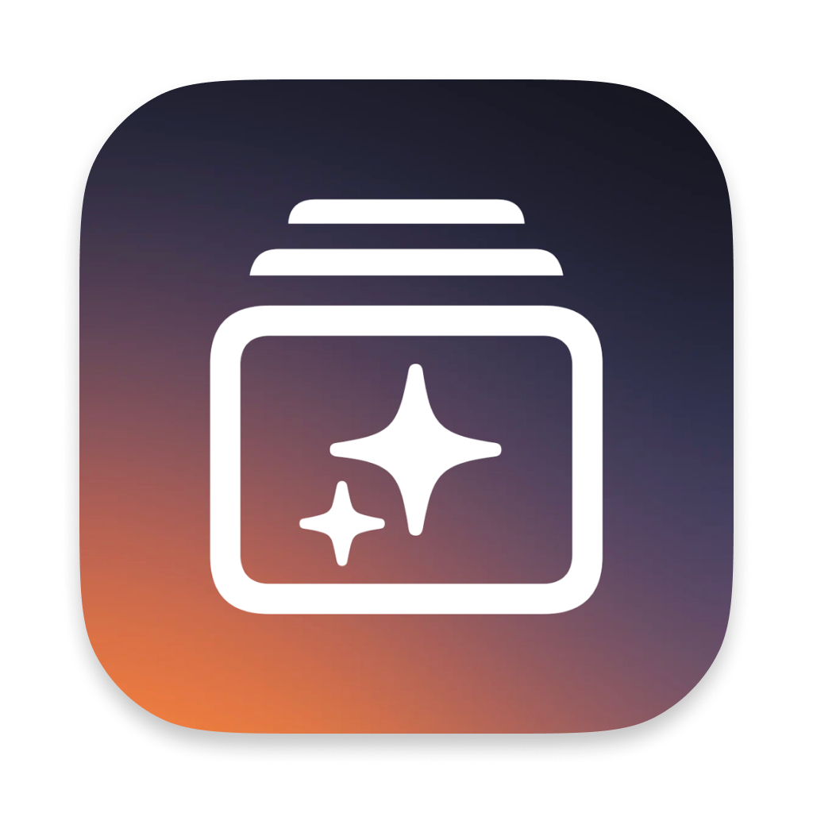
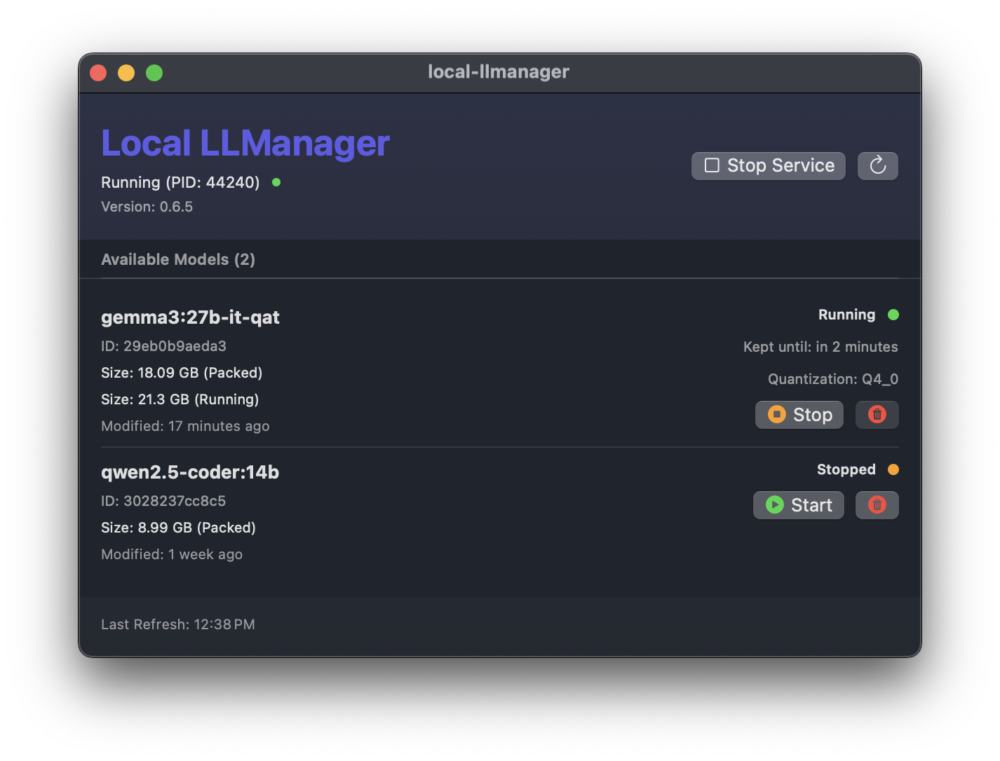

  
  
<strong>Local LLManager</strong>

---

   

# Overview

Local LLManager is a native macOS GUI for [Ollama](https://ollama.com/), built entirely in Swift and SwiftUI. The app provides a streamlined, user-friendly interface for interacting with the Ollama service — no Terminal commands necessary (outside of setup).

> [!NOTE]  
> This is my first Swift project — it's mostly a demo at this point!

## Features

- Native MacOS app
- Support for light/dark mode
- Uses both CLI and API calls to interact with Ollama:
  - CLI for:
    - Starting/stopping the Ollama service
    - Checking service status
  - API for:
    - Managing installed models
    - Retrieving model status and data
- Looks pretty (to me!)

## Roadmap

- [x] Model management (current)
- [ ] Release a build
- [ ] Implement better visual cues for loading
- [ ] Add mock data for Xcode preview views
- [ ] Model downloading support
- [ ] Specify model run duration and temperature (e.g., via keep_alive and options)

## Design Approach

This project follows the MVVM architecture pattern to help me write the code in a cleaner way with a separation of responsibilities. Below is a breakdown of the core design decisions and how different pieces of functionality are implemented.

### Service Control

Service management is performed via CLI for simplicity and reliability.

#### Status Checks

I use pgrep to determine whether the Ollama service is currently running. This approach is fast and avoids the need for deeper system integration or dependencies.

#### Start/Stop Operations

Starting and stopping the service is also handled through CLI commands. The Ollama service cannot be started or stopped via. API.

### API Integration

All model-related functionality is implemented via the Ollama API. This includes:

- Listing installed models
- Listing running models
- Removing models

By isolating all API interaction in the ViewModel layer, the UI remains declarative and reactive.

### Model Refresh

The application refreshes the list of available models every 15 seconds using a scheduled task. This interval strikes a balance between staying up-to-date and minimizing unnecessary resource use. I opted for this polling-based approach rather than setting up notifications or event-driven updates due to the limited nature of Ollama’s current API.

### Asynchronous Design

All operations, both CLI and API, are executed asynchronously. This avoids UI stalls and keeps the interface responsive, particularly during potentially long-running tasks like querying models or starting the service.

## Requirements

- Ollama CLI installed via. [Homebrew](https://brew.sh/)
